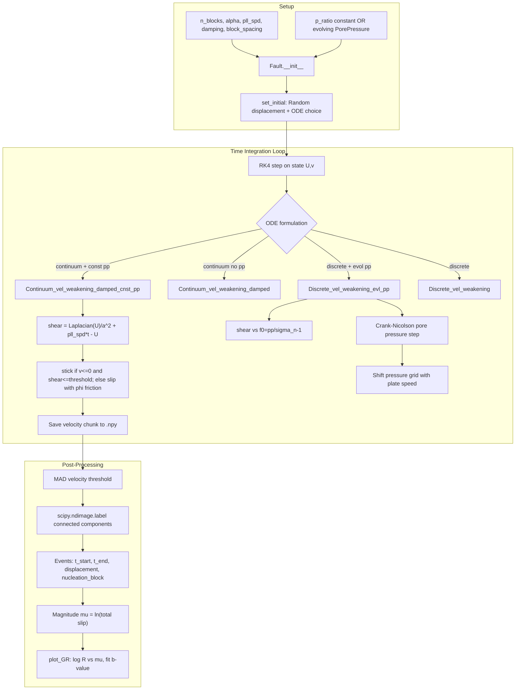
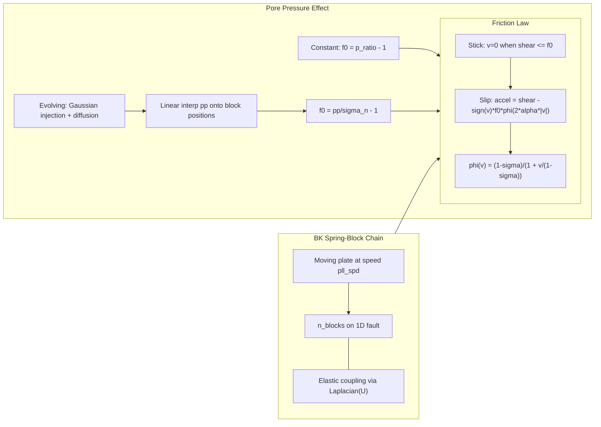

# VSRP-Code: Code Logic Explanation

This document explains how Toby Fleming's VSRP-Code repository works. The code simulates a **1D Burridge–Knopoff (BK) spring-block fault** with **pore pressure** effects and analyzes how fluid injection changes **Gutenberg–Richter (GR) earthquake statistics** (especially the **b-value**).

**Research context:** The accompanying Word document (*BK and Pore pressure.docx*) describes a study of induced seismicity in Enhanced Geothermal Systems (EGS). Fluid injection raises pore pressure, lowers effective normal stress on the fault, and may change the frequency–magnitude distribution of simulated earthquakes.

**Scientific question:** Does increasing pore pressure change the GR slope (b-value) and overall event statistics?

---

## Repository Structure

| File | Role |
|------|------|
| `fault.py` | Core BK physics: friction laws, ODE right-hand sides, RK4 time integration |
| `pore_pressure.py` | 1D pore-pressure diffusion via Crank–Nicolson |
| `event_detection.py` | Detect slip events, plot event maps, GR plots, b-value fitting |
| `PlotGR.py` | Legacy/simple GR plot from saved `.npy` chunks |
| `Notify.py` | Optional email notification when long simulations finish |
| `c_l_faultsim_rt.ipynb` | Main driver: parameter sweeps, chunked simulation, parallel runs |

---

## High-Level Data Flow



---

## Physics Logic



---

## Module-by-Module Logic

### 1. `fault.py` — Fault dynamics

**State:** `self.state` has shape `(2, n_blocks)` — row 0 is displacement `U`, row 1 is velocity `v`.

**Friction helpers (Numba-accelerated):**
- `phi(v)` — Carlson–Langer velocity-weakening friction
- `slip_friction(x, x0)` — alternative slip-weakening law
- `laplacian(U)` — 1D discrete second derivative (elastic coupling between blocks)

**ODE formulations** (selected via `set_initial(..., ODE=...)`):

| ODE key | Used for | Key equation |
|---------|----------|--------------|
| `C_L_ODE_fwrd_continuum_damped_cnst_pp` | **Main notebook runs** — continuum + damping + constant pore pressure | `shear = (1/a²)*∇²U + pll_spd*t - U`; stick when `shear <= \|p_ratio-1\|` |
| `C_L_ODE_fwrd_continuum_damped` | Model validation (reproduce Mori & Kawamura) | Same but threshold = 1.0 |
| `C_L_ODE_fwrd_evl_pp` | Evolving pore pressure | Interpolates `pp` onto blocks; `f0 = pp/σ_n - 1` |
| `C_L_ODE_slip_weakening` | Alternative friction physics | Uses `slip_friction` instead of `phi` |

**Stick-slip rule (Carlson–Langer):** A block sticks if `v <= 0` AND shear stress is below the friction threshold; otherwise it accelerates.

**Time integration:** `simulate()` loops RK4 steps. If evolving pore pressure is enabled, each step also calls `pore_pressure.crank_nicolson_step(dt)` and advects the pressure grid: `xp += dt * pll_spd` (pressure profile moves with the plate).

### 2. `pore_pressure.py` — Diffusion

- Initializes a **Gaussian pressure bump** centered at the injection site (middle of fault)
- Solves `∂P/∂t = D ∇²P` on a fine 1D grid (`res=0.001`) using **Crank–Nicolson** (implicit, stable)
- Optional **Dirichlet clamp** at injection site (`hold_injection_pressure`)
- `build_1d_laplacian_matrix()` shared with `fault.py` for consistent spatial discretization

### 3. `event_detection.py` — Event catalog

**`detect_events_from_hist(hist, dt)`:**
1. Extract velocity field from simulation history
2. Threshold = `1.4826 * MAD(velocity) * factor` (robust noise estimate)
3. Mark blocks where `|v| > threshold` as slipping
4. Group spatiotemporally connected slips into events (`scipy.ndimage.label`)
5. Event size = sum of `|v| * dt` over all blocks/times in the event (proxy for seismic moment)
6. Returns `(t_start, t_end, displacement, nucleation_block, block_count)` per event

**`plot_GR(events)`:** Computes magnitude `μ = ln(displacement)`, histograms, plots `log R(μ)` vs `μ`, fits linear slope → **b-value** = negative of slope.

**`find_events(run, t0)`:** Loads saved velocity chunks from disk, runs detection, concatenates.

### 4. `c_l_faultsim_rt.ipynb` — Simulation driver

Typical parameter sweep:

```python
# [alpha, pll_spd, n_blocks, damping, p_ratio, block_spacing]
params = [1, 0.001, 200/0.0625, 0.02, 0.6, 0.0625]
# ts=0.001, tn=50000, chunk=75 time units per save
```

Workflow per simulation:
1. Create `Fault` with `p_ratio` (constant pore pressure ratio)
2. `set_initial('Random', ODE='C_L_ODE_fwrd_continuum_damped_cnst_pp')`
3. Simulate in **75-unit chunks** (to manage disk/memory)
4. Save velocity slice + checkpoint state (`end_state_*.npy`)
5. Periodically run `find_events()`, append to master event file, delete raw chunks
6. Later cells plot GR curves for different `p_ratio` values (0, 0.6, 0.7, 0.9, etc.)

Uses `joblib.Parallel` to run multiple parameter sets concurrently.

---

## Parameter Reference

| Parameter | Symbol in code | Meaning | Typical value |
|-----------|----------------|---------|---------------|
| `alpha` | `alpha` | Friction velocity-weakening steepness | 1 or 3 |
| `pll_spd` | `pll_spd` | Dimensionless plate loading speed | 0.001 |
| `n_blocks` | `n_blocks` | Number of fault elements | 3200 (= 200/0.0625) |
| `damping_coef` | `n` | Viscous damping (continuum limit) | 0.02 |
| `p_ratio` | `p_ratio` | Pore pressure / normal stress | 0–0.9 |
| `block_spacing` | `a` | Mesh spacing (continuum limit) | 0.0625 |
| `dt` | `ts` | RK4 time step | 0.001 |

---

## Output File Layout

```
event_data_SRF/
  Original_friction__clamped_velocity/
    Sim_{run}/                    # per-run velocity chunks + checkpoint
      end_state_{run}.npy
      event_sample_SRF_{time}
    Pore Pressure in continuum limit/
      Constant pore pressure/
        events_SRF_PPcont_alpha={alpha}=_n={n}_a={a}_ppr={ppr}.npy
Figures/
  GR_{alpha}.png                  # from PlotGR.py
```

---

## References

- Burridge & Knopoff (1967) — original spring-block model
- Carlson & Langer (1989) — velocity-weakening friction and GR statistics
- Myers & Langer (1993), Shaw (1994) — viscous damping for continuum limit
- Mori & Kawamura (2006, 2008) — continuum BK validation
- Hubbert & Rubey (1959) — effective stress and pore pressure

See also the Word document in the parent folder for Toby's full methodology write-up.
